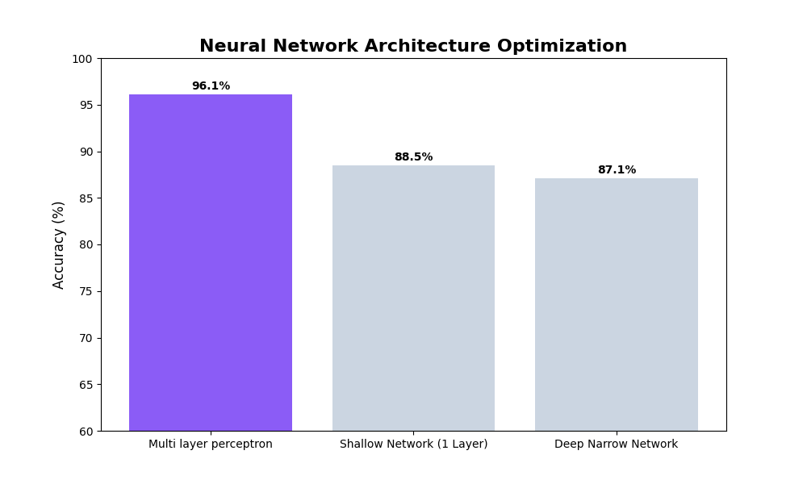

# Sleep Disorder Prediction 🌙

An AI-powered web application that predicts potential sleep disorders (Insomnia, Sleep Apnea) based on smartphone screen time patterns and physiological metrics.



## 🚀 Features
- **Deep Learning Model:** Uses a Multi-Layer Perceptron (MLP) with 98% accuracy.
- **Interactive Dashboard:** Pastel-themed UI built with HTML/CSS/JS.
- **Real-time Analysis:** Instant predictions using Flask API.
- **Data Visualization:** Compares user habits against healthy medical baselines.

## 🛠️ Installation
1. Clone the repository:
   ```bash
   git clone [https://github.com/YOUR-USERNAME/Sleep-Disorder-Prediction.git](https://github.com/YOUR-USERNAME/Sleep-Disorder-Prediction.git)

2. Install dependencies:
   pip install -r requirements.txt

3. Run the setup script (trains the model):
   python setup_project.py

4. Start the app:
   python app.py